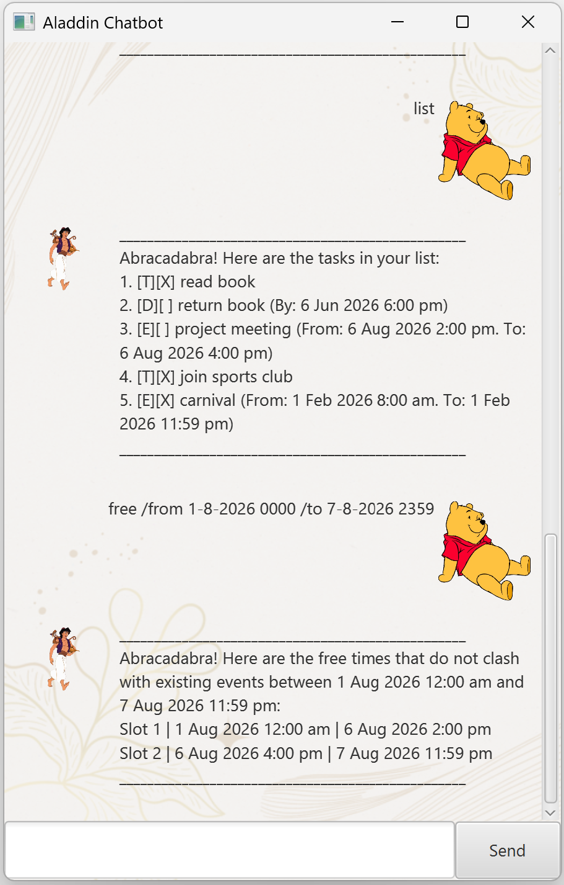
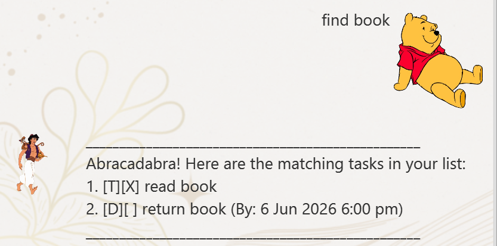
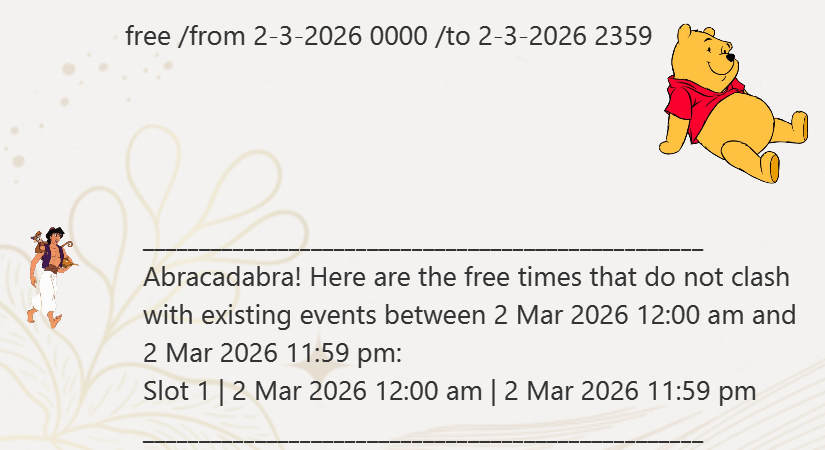

# Aladdin User Guide

## Aladdin Screenshot

> “Your mind is for having ideas, not holding them.” – David Allen ([source](https://dansilvestre.com/productivity-quotes))

Aladdin Pro is an **advanced chatbot** that <ins>frees</ins> your mind of having to remember things you need to do.
It is:
* Text-based
* Very easy to learn
* ~Fast~ _SUPER FAST_ to use

All you will need to do is the following:
1. Download Aladdin (latest release) from [here](https://github.com/elijah-ng/ip/releases)
2. Double click to run it
3. Let it manage your tasks for you!

**MOST** importantly, it is **ABSOLUTELY FREE** forever!

> [!NOTE]
> Aladdin automatically saves your task list into a local storage file, do not edit it yourself.

# Features
> [:information_source:] **Command Format:**
> * Extra parameters for commands that do not take in parameters (i.e. `list`, `bye`) are ignored.
> * The first part of the command (e.g. `list`, `todo`) is case-insensitive.

## Viewing tasks: `list`
Shows a list of all current tasks managed by the chatbot.

Format: `list`

## Adding Todo Task: `todo`
Adds a new "todo" task to the chatbot.

Format: `todo DESCRIPTION`
* `DESCRIPTION` cannot contain the special character `|`.
  
Example:
* `todo exercise`
* `todo buy dinner`

## Adding Deadline Task: `deadline`
Adds a new "deadline" task to the chatbot.

Format: `deadline DESCRIPTION /by BY`
* `DESCRIPTION` cannot contain the special character `|`.
* `BY` must be in d-M-yyyy HHmm format.

Example:
* `deadline homework /by 1-3-2026 1900`

## Adding Event Task: `event`
Adds a new "event" task to the chatbot.

Format: `event DESCRIPTION /from FROM /to TO`
* `DESCRIPTION` cannot contain the special character `|`.
* `FROM` and `TO` must be in d-M-yyyy HHmm format.
* `FROM` must be before `TO`.

Example:
* `event carnival /from 2-3-2026 1200 /to 2-3-2026 1700`

## Marking Task as Completed: `mark`
Marks the specified task as completed.

Format: `mark NUMBER`
* Marks the task as completed at the specified `NUMBER`.
* `NUMBER` refers to the task number shown in `list`.
* `NUMBER` must be a positive integer and specify a valid task.
* Completed task is shown with `[X]`

Example:
* `mark 1`

## Unmarking Task as Uncompleted: `unmark`
Unmarks the specified task as uncompleted.

Format: `unmark NUMBER`
* Unmarks the task as completed at the specified `NUMBER`.
* `NUMBER` refers to the task number shown in `list`.
* `NUMBER` must be a positive integer and specify a valid task.
* Uncompleted task is shown with `[]`

Example:
* `unmark 1`

## Deleting a Task: `delete`
Deletes the specified task.
Format: `delete NUMBER`
* Deletes the task at the specified `NUMBER`.
* `NUMBER` refers to the task number shown in `list`.
* `NUMBER` must be a positive integer and specify a valid task.

Example:
* `delete 1`

## Finding Tasks by Description: `find`
Finds tasks whose description contains the given keyword
Format: `find KEYWORD`
* The search is case-sensitive.

Example:
* `find meeting`
* `find book`
 

## Search for Free Time Slots: `free`
Search for free time slots between the specified range, that do not clash with existing Events.

Format: `free /from FROM /to TO`
* `FROM` and `TO` must be in d-M-yyyy HHmm format.
* `FROM` must be before `TO`.

Example:
* `free /from 2-3-2026 0000 /to 2-3-2026 2359`

Returns a numbered list of all free time slots available between the specified range. 

Note that a free time slot can start at the exact time that an existing event ends, or end at the same time that an existing event starts.

## Exiting the program: `bye`
Exits the chatbot.

Format: `bye`

## Saving Data
Aladdin chatbot automatically saves your tasks to a file for archive after any task is modified (e.g. add, delete, mark/unmark). There is no need to save manually.

Aladdin will remember your tasks from a previous session (if any) when you use the chatbot again.

### User Guide Credits
* User Guide format inspired by https://se-education.org/addressbook-level3/UserGuide.html

### Image Credits
* https://www.vhv.rs/viewpic/iTRixoJ_winnie-the-pooh-clipart-high-resolution-transparent-background/
* https://www.nicepng.com/ourpic/u2q8i1r5a9y3y3e6_aladdin-and-abu-aladdin-and-abu-png/#google_vignette
* https://www.canva.com/templates/EAGnYt64Sg8-elegant-minimalist-background-gold-and-beige-instagram-post/